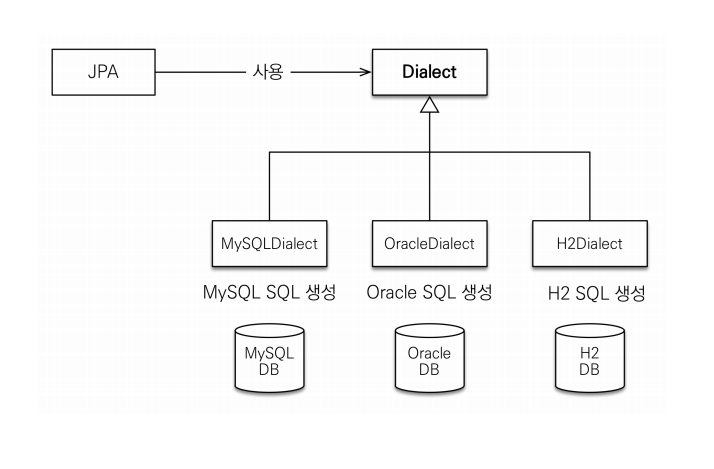
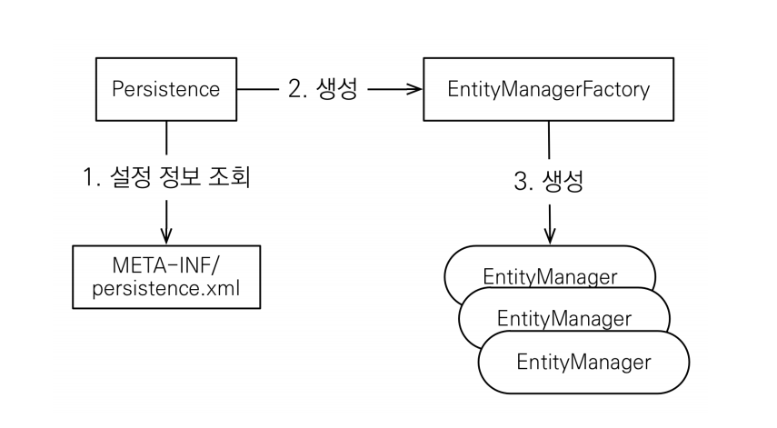

## 2. JPA 시작

### 2-1. Hello JPA 프로젝트 생성

___

#### 2-1-1. 개발환경
1. H2 데이터베이스
    - 최고의 실습용 DB
    - 가볍다.(1.5M)
    - 웹용 쿼리툴 제공
    - MySQL, Oracle 데이터베이스 시뮬레이션 기능
    - 시퀀스, AUTO INCREMENT 기능 지원
    
2. 메이븐
    - 자바 라이브러리, 빌드 관리
    - 라이브러리 자동 다운로드 및 의존성 관리
    - 최근에는 그래들(Gradle)이 점점 유명
    
#### 2-1-2. JPA 설정 및 데이터베이스 방언

1. JPA 설정하기
    - JPA 설정 파일
    - /META-INF/persistence.xml 위치
    - persistence-unit name으로 이름 지정
    - `javax.persistence`로 시작: JPA 표준 속성
    - hibernate로 시작: 하이버네이트 전용 속성
    - [persistence.xml](/JPA-Basic/ex1-hello-jpa/src/main/resources/META-INF/persistence.xml)

2. 데이터베이스 방언
    - JPA는 특정 데이터베이스에 종속 X
    - 각각의 데이터베이스가 제공하는 SQL 문법과 함수는 조금씩 다름
    - 가변 문자: MySQL은 VARCHAR, Oracle은 VARCHAR2
    - 문자열을 자르는 함수: SQL 표준은 SUBSTRING(), Oracle은 SUBSTR()
    - 페이징: MySQL은 LIMIT , Oracle은 ROWNUM
    - 방언: SQL 표준을 지키지 않는 특정 데이터베이스만의 고유한 기능
    - hibernate.dialect 속성에 지정한다. 
      - H2 : org.hibernate.dialect.H2Dialect
      - Oracle 10g : org.hibernate.dialect.Oracle10gDialect
      - MySQL : org.hibernate.dialect.MySQL5InnoDBDialect
    - 하이버네이트는 40가지 이상의 데이터베이스 방언 지원
    
    

### 2-2. Hello JPA 애플리케이션 개발

1. JPA 구동방식

   
2. JPQL
   - 가장 단순한 조회 방법
   - JPA는 SQL을 추상화한 JPQL이라는 객체 지향 쿼리 언어 제공
   - SQL과 문법 유사, SELECT, FROM, WHERE, GROUP BY, HAVING, JOIN 지원
   - JPQL은 엔티티 객체를 대상으로 쿼리
   - SQL은 데이터베이스 테이블을 대상으로 쿼리
     
3. JPQL의 필요성
   - JPA를 사용하면 엔티티 객체를 중심으로 개발
   - 검색을 할 때도 테이블이 아닌 엔티티 객체를 대상으로 검색
   - 모든 DB 데이터를 객체로 변환해서 검색하는 것은 불가능
   - 애플리케이션이 필요한 데이터만 DB에서 불러오려면 결국 검색 조건이 포함된 SQL이 필요
   
__*JPQL = 객체지향 SQL*__
   
