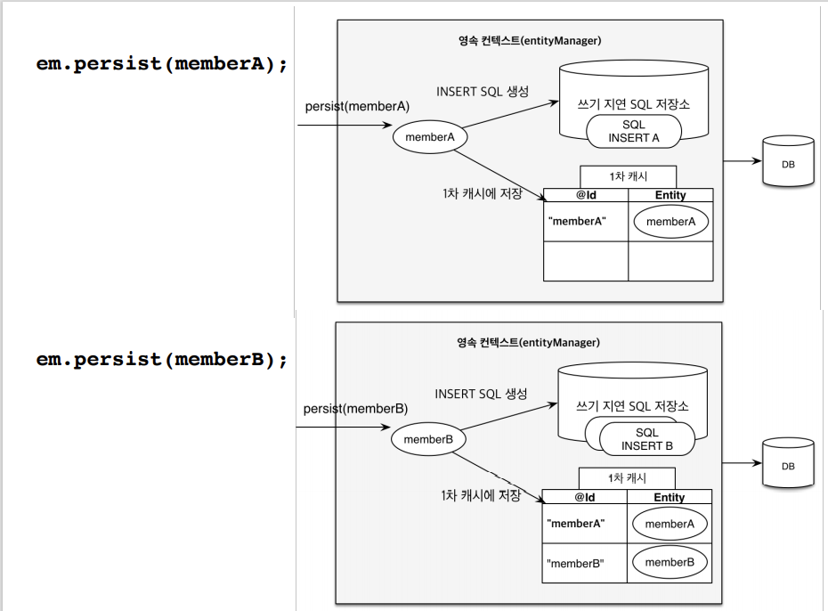
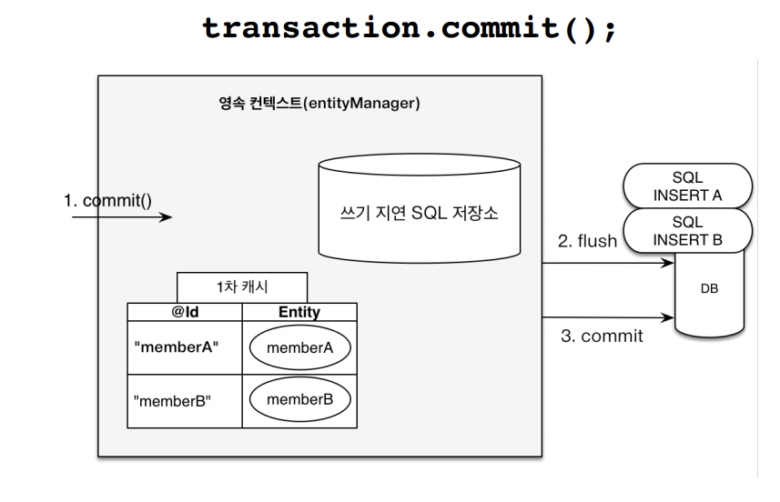
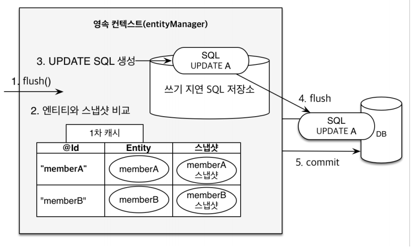

## 3. 영속성 관리

### 3-1. 영속성 컨텍스트

___

#### 3-1-1. JPA에서 가장 중요한 2가지

1. 객체와 관계형 데이터베이스 매핑하기(ORM)
2. 영속성 컨텍스트

**영속성 컨텍스트란**

- JPA를 이해하는데 가장 중요한 용어
- 엔터티를 영구 저장하는 환경
- 논리적인 개념임.
- 눈에 보이지 않음.
- 엔티티 매니저를 통해서 영속성 컨텍스트에 접근함.
    - J2SE 환경은 엔티티 매니저와 영속성 컨텍스트가 1:1
    - J2EE, 스프링 프레임워크 같은 컨테이너 환경은 N:1

#### 3-1-2. 엔티티의 생명주기


- 비영속 (new/transient): 영속성 컨텍스트와 전혀 관계가 없는 새로운 상태

```text
//객체를 생성한 상태(비영속) 
Member member = new Member(); 
member.setId("member1"); 
member.setUsername(“회원1”);
  ```

- 영속 (managed): 영속성 컨텍스트에 관리되는 상태

```text
//객체를 생성한 상태(비영속) 
Member member = new Member(); 
member.setId("member1"); 
member.setUsername(“회원1”);

EntityManager em = emf.createEntityManager();
em.getTransaction().begin();

//객체를 저장한 상태(영속)
em.persist(member); // DB에 저장되는 것은 아님!!
```

- 준영속 (detached): 영속성 컨텍스트에 저장되었다가 분리된 상태

```text
//회원 엔티티를 영속성 컨텍스트에서 분리, 준영속 상태 
em.detach(member); 
```

- 삭제 (removed): 삭제된 상태

```text
//객체를 삭제한 상태(삭제) 
em.remove(member);
```

#### 3-1-3. 영속성 컨텍스트의 장점

1. 1차 캐시
    - 영속성 컨텍스트 안에는 1차캐시가 있음
    - 조회할 때 1차 캐시에서 조회(`@Id`)하게 됨.
    - 조회할 때 1차 캐시에 없으면? DB에서 조회 후, 1차캐시에 저장한 뒤에 반환함
    - 하나의 트랜잭션 안에서만 동작하므로 크게 성능의 이점을 얻을 수 있지는 않다.(2차 캐시는 전체 애플리케이션)

2. 동일성(identity) 보장
    - 1차 캐시로 반복 가능한 읽기(REPEATABLE READ) 등급의 트랜잭션 격리 수준을 데이터베이스가 아닌 애플리케이션 차원에서 제공

3. 트랜잭션을 지원하는 쓰기 지연(transactional write-behind)

```text
EntityManager em = emf.createEntityManager();
EntityTransaction transaction = em.getTransaction();

//엔티티 매니저는 데이터 변경시 트랜잭션을 시작해야 한다.
transaction.begin(); // [트랜잭션] 시작

em.persist(memberA);
em.persist(memberB);
//여기까지 INSERT SQL을 데이터베이스에 보내지 않는다.

//커밋하는 순간 데이터베이스에 INSERT SQL을 보낸다.
transaction.commit(); // [트랜잭션] 커밋
```




- 영속성 컨텍스트 안에는 쓰기 지연 SQL 저장소가 있음.

4. 변경 감지(Dirty Checking)

```text
EntityManager em = emf.createEntityManager();
EntityTransaction transaction = em.getTransaction();
transaction.begin(); // [트랜잭션] 시작

// 영속 엔티티 조회
Member memberA = em.find(Member.class, "memberA");

// 영속 엔티티 데이터 수정
memberA.setUsername("hi");
memberA.setAge(10);

//em.update(member) 이런 코드가 있어야 하지 않을까?

transaction.commit(); // [트랜잭션] 커밋
```



- 스냅샷이란? - 최초시점을 떠놓음
- flush는 아래에 자세히 설명

5. 지연 로딩(Lazy Loading)

#### 3-1-4. 플러시

**플러시**: 영속성 컨텍스트의 변경내용을 데이터베이스에 반영하는 것

- 영속성 컨텍스트를 비우지 않음
- 영속성 컨텍스트의 변경내용을 데이터베이스에 동기화
- 트랜잭션이라는 작업 단위가 중요 -> **커밋 직전에만 동기화하면 됨**

**플러시 발생**

- 변경감지
- 수정된 엔티티 쓰기 지연 SQL 저장소에 등록
- 쓰기 지연 SQL 저장소의 쿼리를 데이터베이스에 전송(등록, 수정, 삭제 쿼리)

**영속성 컨텍스트를 플러시하는 방법**

- em.flush() - 직접 호출
- 트랜잭션 커밋: 플러시 자동 호출
- JPQL 쿼리 실행: 플러시 자동 호출
    - 이유: 문제를 생기는 것을 방지하기 위해서 무조건 날리고 봄.

**플러시 모드 옵션** => 알아만 놓자.

- FlushModeType.AUTO: 커밋이나 쿼리를 실행할 때 플러시 (기본값)
  FlushModeType.COMMIT: 커밋할 때만 플러시

ex) `em.setFlushMode(FlushModeType.COMMIT)`

#### 3-1-5. 준영속 상태

**준영속 상태** => detach 상태라고도 함

- 영속 -> 준영속
    - persist로 집어넣을 때도 영속상태가 되고 find해서 영속상태가 아닐 때도 영속상태로 만들어줌.
- 영속 상태의 엔티티가 영속성 컨텍스트에서 분리(detached)
- 영속성 컨텍스트가 제공하는 기능을 사용 못함

**준영속 상태로 만드는 방법**

- em.detach(entity): 특정 엔티티만 준영속 상태로 전환 -> 영속성 컨텍스트에서 빠짐
- em.clear(): 영속성 컨텍스트를 완전히 초기화 -> 테스트할 때 주로 씀
- em.close(): 영속성 컨텍스트를 종료
