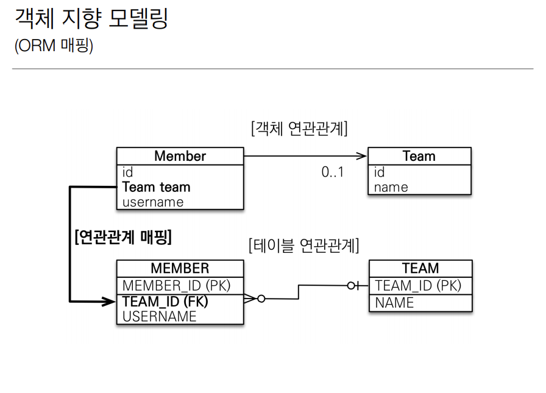

## 5. 연관관계 매핑 기초

### 5-1. 연관관계가 필요한 이유

___

#### 5-1-1. 용어 이해

- **방향(Direction)**: 단방향, 양방향
- **다중성(Multiplicity)**: 다대일(N:1), 일대다(1:N), 일대일(1:1), 다대다(N:M) 이해
- **연관관계의 주인(Owner)**: 객체 양방향 연관관계는 관리 주인이 필요

> 객체지향 설계의 목표는 자율적인 객체들의 협력 공동체를 만드는 것이다.

**객체를 테이블에 맞추어 데이터 중심으로 모델링하면, 협력 관계를 만들 수 없다.**

- 테이블은 **외래 키**로 조인을 사용해서 연관된 테이블을 찾는다.
- 객체는 **참조**를 사용해서 연관된 객체를 찾는다.

### 5-2. 단방향 연관관계

___

### 5-3. 양방향 연관관계와 연관관계의 주인

___
해당 파트는 JPA에서 어렵고 중요한 개념을 다룸.

양방향 매핑: 반대 방향으로 객체 그래프 탐색 가능

- 사실 단방향을 쓰는 것이 좋다.

#### 5-3-1. 객체와 테이블이 관계를 맺는 차이

1. 객체 연관관계 = 2개
    - 객체의 양방향 관계는 사실 양방향 관계가 아니라 서로 다른 단뱡향 관계 2개다.
    - 객체를 양방향으로 참조하려면 단방향 연관관계를 2개 만들어야 한다.
    - ex) 회원 -> 팀 연관관계 1개(단방향), 팀 -> 회원 연관관계 1개(단방향)
2. 테이블 연관관계 = 1개
    - 테이블은 외래 키 하나로 두 테이블의 연관관계를 관리
    - ex) 회원 <-> 팀의 연관관계 1개(양방향)

❓ 그러면 객체는 둘 중에 무엇으로 외래 키를 관리해야 하지?

✔ 그래서 연관관계의 주인이 나옴!

#### 5-3-2. 연관관계의 주인(Owner)

**양방향 매핑규칙**

- 객체의 두 관계중 하나를 연관관계의 주인으로 지정
- 연관관계의 주인만이 외래 키를 관리(등록, 수정)
- 주인이 아닌쪽은 읽기만 가능
- 주인은 mappedBy 속성 사용하지 말 것
- 주인이 아니면 mappedBy 속성으로 주인 지정
- 비즈니스 로직을 기준으로 연관관계의 주인을 선택하면 안됨
- 연관관계의 주인은 외래 키의 위치를 기준으로 정해야함

#### 5-3-3. 양뱡향 연관관계 주의

- 순수 객체 상태를 고려해서 항상 양쪽에 값을 설정하자
- 연관관계 편의 메소드를 생성하자
- 양방향 매핑시에 무한 루프를 조심하자
    - 예: toString(), lombok, JSON 생성 라이브러리

**정리**

- **단방향 매핑만으로도 이미 연관관계 매핑은 완료**
- 양방향 매핑은 반대 방향으로 조회(객체 그래프 탐색) 기능이 추가된 것 뿐
- JPQL에서 역방향으로 탐색할 일이 많음
- 단방향 매핑을 잘 하고 양방향은 필요할 때 추가해도 됨(테이블에 영향을 주지 않음)
