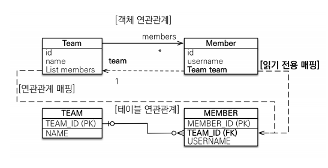
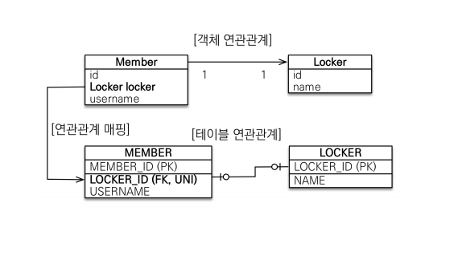
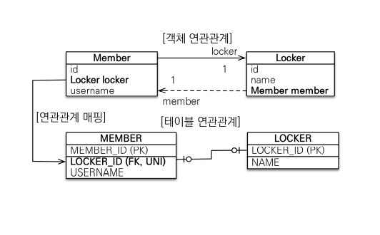
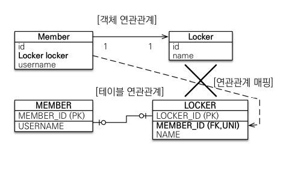
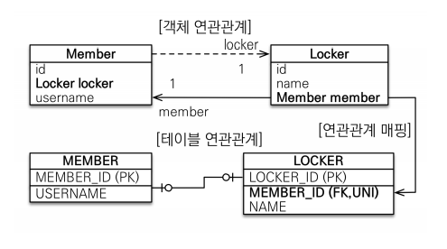
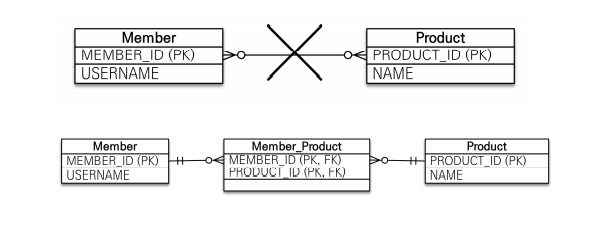
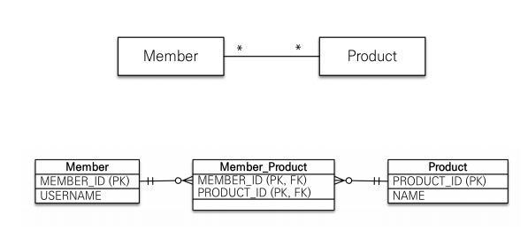

## 6. 다양한 연관관계 매핑

### 6-1. 연관관계 매핑시 고려사항 3가지

___

#### 6-1-1. 다중성

- 다대일: `@ManyToOne`
- 일대다: `@OneToMany`
- 일대일: `@OneToOne`
- 다대다: `@ManyToMany`
    - 사실상 다대다는 쓰면 안됨.

#### 6-1-2. 단방향, 양방향

- 테이블
    - 외래 키 하나로 양쪽 조인 가능
    - 사실 방향이라는 개념이 없음
- 객체
    - 참조용 필드가 있는 쪽으로만 참조 가능
    - 한쪽만 참조하면 단방향
    - 양쪽이 서로 참조하면 양방향

#### 6-1-3. 연관관계의 주인

- 테이블은 외래 키 하나로 두 테이블이 연관관계를 맺음
- 객체 양방향 관계는 A->B, B->A 처럼 참조가 2군데
- 객체 양방향 관계는 참조가 2군데 있음. 둘중 테이블의 외래 키를 관리할 곳을 지정해야함
- 연관관계의 주인: 외래 키를 관리하는 참조
- 주인의 반대편: 외래 키에 영향을 주지 않음, 단순 조회만 가능

### 6-2. 다대일[N:1]

___

#### 6-2-1. 다대일 단방향

- 가장 많이 사용하는 연관관계
- **다대일**의 반대는 **일대다**

#### 6-2-2. 다대일 양방향

- 외래 키가 있는 쪽이 연관관계의 주인
- 양쪽을 서로 참조하도록 개발

### 6-3. 일대다[1:N]

___
실무에서 잘 안쓰인다.

#### 6-3-1. 일대다 단방향

- 일대다 단방향은 일대다(1:N)에서 일(1)이 연관관계의 주인
- 테이블 일대다 관계는 항상 다(N) 쪽에 외래 키가 있음
- 객체와 테이블의 차이 때문에 반대편 테이블의 외래 키를 관리하는 특이한 구조
- `@JoinColumn`을 꼭 사용해야 함. 그렇지 않으면 조인 테이블 방식을 사용함(중간에 테이블을 하나 추가함)

- **일대다 단방향 매핑의 단점**
    - 엔티티가 관리하는 외래 키가 다른 테이블에 있음
    - 연관관계 관리를 위해 추가로 UPDATE SQL 실행

- 일대다 단방향 매핑보다는 **다대일 양방향 매핑**을 사용하자

#### 6-3-2. 일대다 양방향

- 이런 매핑은 공식적으로 존재X
- `@JoinColumn(insertable=false, updatable=false)`
- 읽기 전용 필드를 사용해서 양방향 처럼 사용하는 방법
- 다대일 양방향을 사용하자

### 6-4. 일대일[1:1]

___

- 일대일 관계는 그 반대도 일대일
- 주 테이블이나 대상 테이블 중에 외래 키 선택 가능
    - 주 테이블에 외래 키
    - 대상 테이블에 외래 키
- 외래 키에 데이터베이스 유니크(UNI) 제약조건 추가

#### 6-4-1. 주 테이블에 외래 키 단방향

- 다대일(`@ManyToOne`) 단방향 매핑과 유사

#### 6-4-2. 주 테이블에 외래 키 양방향

- 다대일 양방향 매핑 처럼 외래 키가 있는 곳이 **연관관계의 주인**
- 반대편은 `mappedBy` 적용

#### 6-4-3. 대상 테이블에 외래 키 단방향

- 단방향 관계는 JPA 지원X
- 양방향 관계는 지원

#### 6-4-4. 대상 테이블에 외래 키 양방향

- 사실 일대일 주 테이블에 외래 키 양방향과 매핑 방법은 같음

#### 6-4-5. 일대일 정리

1. 주 테이블에 외래 키

- 객체가 대상 객체의 참조를 가지는 것 처럼 주 테이블에 외래 키를 두고 대상 테이블을 찾음
- 객체지향 개발자 선호
- JPA 매핑 편리
- 장점: 주 테이블만 조회해도 대상 테이블에 데이터가 있는지 확인 가능
- 단점: 값이 없으면 외래 키에 null 허용
- DBA 와 협의 필요

2. 대상 테이블에 외래 키

- 대상 테이블에 외래 키가 존재
- 전통적인 데이터베이스 개발자 선호
- 장점: 주 테이블과 대상 테이블을 일대일에서 일대다 관계로 변경할 때 테이블 구조 유지
- 단점: 프록시 기능의 한계로 **지연 로딩으로 설정해도 항상 즉시 로딩**됨(프록시는 뒤에서 설명)

### 6-5. 다대다[N:M]

___
관계형 데이터베이스는 정규화된 테이블 2개로 다대다 관계를 표현할 수 없으므로, 연결 테이블을 추가해서 일대다, 다대일 관계로 풀어내야 한다.

**객체는 컬렉션을 사용해서 객체 2개로 다대다 관계 가능**

- `@ManyToMany` 사용
- `@JoinTable`로 연결 테이블 지정
- 다대다 매핑: 단방향, 양방향 가능

#### 6-5-1. 다대다 매핑의 한계

- 편리해 보이지만 실무에서 사용하지 말것
- 연결 테이블이 단순히 연결만 하고 끝나지 않음
- 주문시간, 수량 같은 데이터가 들어올 수 있음

#### 6-5-2. 다대다 한계 극복

- 연결 테이블용 엔티티 추가(연결 테이블을 엔티티로 승격)
- `@ManyToMany` -> `@OneToMany`, `@ManyToOne`

✔ **N:M 관계는 1:N, N:1로**

- 테이블의 N:M 관계는 중간 테이블을 이용해서 1:N, N:1
- 실전에서는 중간 테이블이 단순하지 않다.
- `@ManyToMany` 제약: 필드 추가X, 엔티티 테이블 불일치
- 실전에서는 `@ManyToMany` 사용X

### 6-6. 어노테이션

___

#### 6-6-1. `@JoinColumn`

외래 키를 매핑할 때 사용함.

|속성|설명|기본값|
|----|----|-----|
|name|매핑할 외래 키 이름|필드명 + _ + 참조하는 테이블의 기본 키 컬럼명|
|referencedColumnName|외래 키가 참조하는 대상 테이블의 컬럼명|참조하는 테이블의 기본키 컬럼명|
|foreignKey(DDL)|외래 키 제약조건을 직접 지정할 수 있다. 이 속성은 테이블을 생성할 때만 사용한다.|
|unique nullable insertable updatable columnDefinition table|`@Column`의 속성과 같다.|

#### 6-6-2. `@ManyToOne`

다대일 관계 매핑

|속성|설명|기본값|
|----|----|-----|
|optional|false로 설정하면 연관된 엔티티가 항상 있어야 한다.|TRUE|
|fetch|글로벌 페치 전략을 설정한다.|`@ManyToOne=FetchType.EAGER` `@OneToMany=FetchType.LAZY`
|cascade|영속성 전이 기능을 사용한다.|
|targetEntity|연관된 엔티티의 타입 정보를 설정한다. 이 기능은 거의 사용하지 않는다. 컬렉션을 사용해도 제네릭으로 타입 정보를 알 수 있다.

#### 6-6-3. `@OneToMany`

다대일 관계 매핑

|속성|설명|기본값|
|----|----|-----|
|mappedBy|연관관계의 주인 필드를 선택한다.|
|fetch|글로벌 페치 전략을 설정한다.|`@ManyToOne=FetchType.EAGER` `@OneToMany=FetchType.LAZY`
|cascade|영속성 전이 기능을 사용한다.|
|targetEntity|연관된 엔티티의 타입 정보를 설정한다. 이 기능은 거의 사용하지 않는다. 컬렉션을 사용해도 제네릭으로 타입 정보를 알 수 있다.
