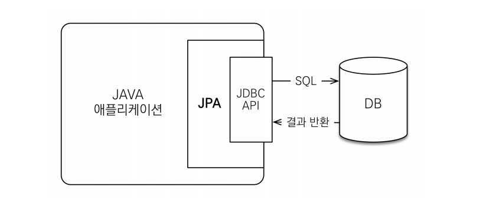
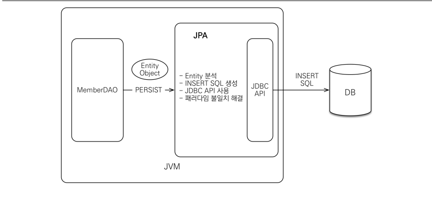
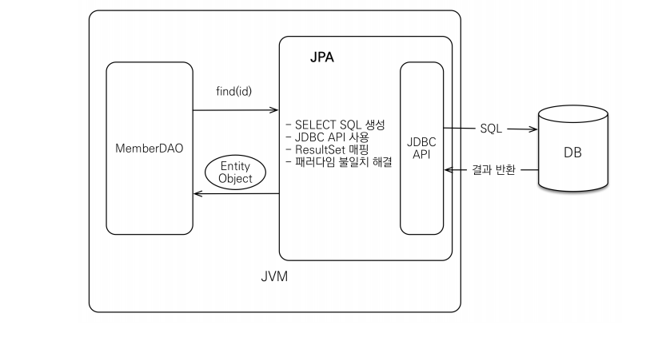

# 자바 ORM 표준 JPA 프로그래밍 - 기본편
> ref. Inflearn 김영한 님의 자바 ORM 표준 JPA 프로그래밍 - 기본편 정리

## 1. JPA 소개

### 1-1. SQL 중심적인 개발의 문제점

___

- SQL에 의존적인 개발을 피하기 어려움
- 객체답게 모델링 할수록 매핑 작업만 늘어난다.

위와 같은 문제점으로 인해 자연스레 의문이 든다.

❓ 객체를 자바 컬렉션에 저장 하듯이 DB에 저장할 수는 없을까?

이를 해결해 주는 것이 바로

__*JPA-Java Persistence API*__

### 1-2. JPA와 ORM

___
__JPA__

- Java Persistence API
- 자바 진영의 ORM 기술 표준
- JPA는 인터페이스의 모음
- JPA 2.1 표준 명세를 구현한 3가지 구현체
- 하이버네이트, EclipseLink, DataNucleus

__ORM__

- Object-relational mapping(객체 관계 매핑)
- 객체는 객체대로 설계
- 관계형 데이터베이스는 관계형 데이터베이스대로 설계
- ORM 프레임워크가 중간에서 매핑
- 대중적인 언어에는 대부분 ORM 기술이 존재

### 1-3. JPA의 동작

___

1. JPA는 애플리케이션과 JDBC 사이에서 동작한다.

2. JPA 저장

3. JPA 조회

### 1-4. JPA 버전

___

- JPA 1.0(JSR 220) 2006년 : 초기 버전. 복합 키와 연관관계 기능이 부족
- JPA 2.0(JSR 317) 2009년 : 대부분의 ORM 기능을 포함, JPA Criteria 추가
- JPA 2.1(JSR 338) 2013년 : 스토어드 프로시저 접근, 컨버터(Converter), 엔티 티 그래프 기능이 추가

### 1-5. JPA를 왜 사용해야 할까?

___

1. SQL 중심적인 개발에서 객체 중심으로 개발

2. 생산성
    - 저장: `jpa.persist(member)`
    - 조회: `Member member = jpa.find(memberId)`
    - 수정: `member.setName(“변경할 이름”)`
    - 삭제: `jpa.remove(member)`

3. 유지보수
    - 기존: 필드 변경시 모든 SQL 수정
    - JPA: 필드만 추가하면 됨, SQL은 JPA가 처리

4. 패러다임의 불일치 해결
    - JPA와 상속
    - JPA와 연관관계
    - JPA와 객체 그래프 탐색
    - JPA와 비교하기
        - 동일한 트랜잭션에서 조회한 엔티티는 같음을 보장
5. 성능
    - 1차 캐시와 동일성(identity) 보장
        - 같은 트랜잭션 안에서는 같은 엔티티를 반환 - 약간의 조회 성능 향상
        - DB Isolation Level이 Read Commit이어도 애플리케이션에서 Repeatable Read 보장
    - 트랜잭션을 지원하는 쓰기 지연(transactional write-behind)
        - 트랜잭션을 커밋할 때까지 INSERT SQL을 모음
        - JDBC BATCH SQL 기능을 사용해서 한번에 SQL 전송
        - UPDATE, DELETE로 인한 로우(ROW)락 시간 최소화
        - 트랜잭션 커밋 시 UPDATE, DELETE SQL 실행하고, 바로 커밋
    - 지연 로딩(Lazy Loading)
        - 지연 로딩: 객체가 실제 사용될 때 로딩
        - 즉시 로딩: JOIN SQL로 한번에 연관된 객체까지 미리 조회

6. 데이터 접근 추상화와 벤더 독립성

7. 표준

__*ORM은 객체와 RDB 두 기둥위에 있는 기술이다.*__

## 요약정리 모음

[2.JPA시작](/JPA-Basic/Summary/02.JPA시작.md)

[3.영속성관리](/JPA-Basic/Summary/03.영속성관리.md)

[4.엔티티매핑](/JPA-Basic/Summary/04.엔티티매핑.md)
